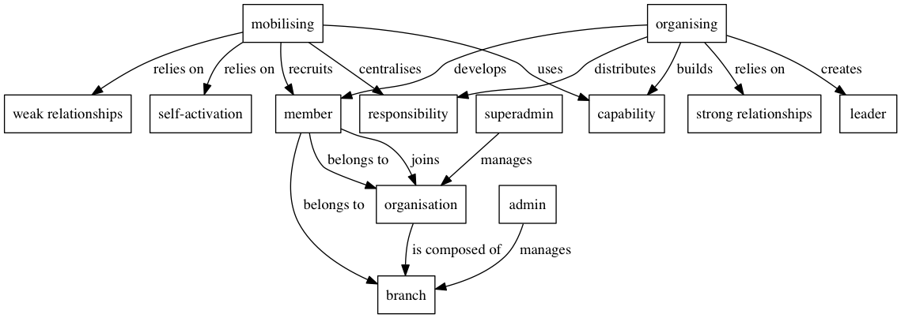

# Rabble Rouser docs

Herein shall be found all the documentation that pertains to the Rabble Rouser project as a whole. Documentation for Rabble Rouser apps should still be found in the relevant repos. 

Documents that should live in here include anything related to overall architecture and infrastructure, project goals or anything that isn't specific to a particular app.

## Rabble Rouser Domain Concepts

This is one attempt to document Rabble Rouser's domain language. We're using a tool called [concept maps](http://cmap.ihmc.us/docs/theory-of-concept-maps). Concept maps only document the language we use, they are not meant to describe behaviour of a system.

Use the Rabble Rouser concept map when learning about the project, or introducing others to it, so we can have a common language and understanding when we speak about the project.

To update the concept map, you'll need [Graphviz](http://www.graphviz.org/) installed. Graphviz is a command line tool for drawing graphs. We're using the [DOT language](http://www.graphviz.org/content/dot-language) to describe our concepts. Concepts look like:

    member -> organisation [label=" joins "]

Formatting graphs in graphviz is a bit painful, so concepts are nodes, and the edge between them is the relationship.

To rebuild the graph, try running:

    dot -Tpng concept_map.gv -o concept_map.png

Please commit the updated concept map and output.
